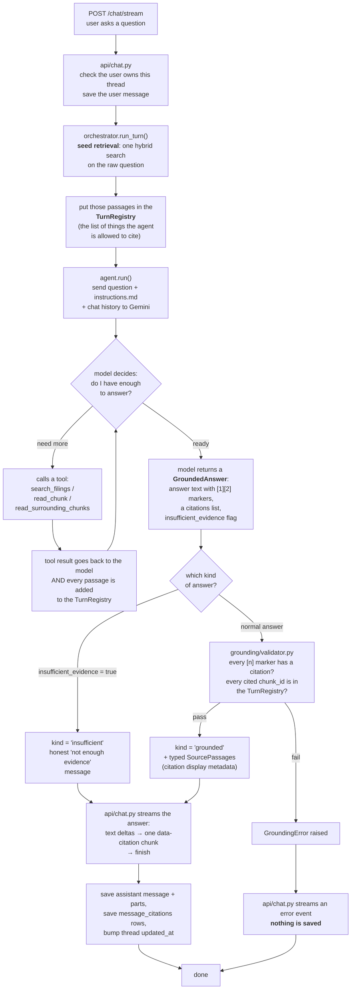

# Assistant

The LLM boundary. This package turns an analyst's question into a **grounded
answer** — an answer where every factual sentence carries a `[n]` marker backed
by a real passage the agent retrieved from the SEC filing corpus. If it can't do
that honestly, it says so instead of guessing.

See [../../../docs/architecture.md](../../../docs/architecture.md) for the
product-level design and [../../CLAUDE.md](../../CLAUDE.md) for backend conventions.
Retrieval lives in [../retrieval/](../retrieval/README.md); the grounding check
lives in [../grounding/](../grounding/); the HTTP + streaming + persistence layer
is [../chat/](../chat/) and [../api/chat.py](../api/chat.py). This package is just
the agent, its tools, its typed output, and its instructions.

## What happens in one turn, start to end



### In plain words

1. **Seed search.** Before the model sees anything, the orchestrator runs one
   hybrid search on the raw question and drops the results into a fresh
   `TurnRegistry`. This guarantees the model always starts with *some* real
   context, even if it never calls a tool.
2. **The agent runs.** Gemini gets the question, the rules
   ([`instructions.md`](instructions.md)), and the prior conversation. It can
   answer directly from the seed passages, or call tools to search for more,
   read a chunk in full, or read the chunks around a promising hit.
3. **Every retrieval is recorded.** The seed search and every tool call add their
   passages to the `TurnRegistry`. That registry is the **trust boundary** — the
   only `chunk_id`s the answer is allowed to cite.
4. **The model returns a typed answer** ([`GroundedAnswer`](outputs.py)):
   the prose with `[n]` markers, a list of `Citation` objects (which `[n]`, which
   `chunk_id`, a verbatim `excerpt`), and an `insufficient_evidence` flag.
5. **Three outcomes:**

   | Outcome | When | What the user gets | Saved? |
   |---|---|---|---|
   | **grounded** | normal answer, passes validation | the answer + clickable citations | yes |
   | **insufficient** | model set `insufficient_evidence=true` | honest "the corpus doesn't cover this" message | yes |
   | **violation** | answer cites a chunk it never retrieved, or makes claims with no `[n]` markers | a generic error event | **no — persist nothing** |

   The difference between *insufficient* and *violation* matters: "I don't have
   the evidence" is an honest, useful answer worth keeping. "I answered but the
   citations don't check out" is a broken answer that must never reach an analyst.

## Files

| File | Purpose |
|---|---|
| `agent.py` | The PydanticAI `Agent`: the Gemini model (with short retry backoff for transient 429/503), the three retrieval tools, and `GroundedAnswer` as the enforced output shape. Module-level singleton — tests swap the model with `agent.override(model=TestModel(...))`. |
| `deps.py` | `DocumentAgentDeps` (what the tools need at runtime: the retriever, a DB session factory, the registry) and `TurnRegistry` (the cite-allow-list, keyed by `chunk_id`, also holds each passage's neighbors). |
| `outputs.py` | `GroundedAnswer` (model-produced), `Citation` (model-produced), `SourcePassage` (**not** model-produced — the validator builds it from the registry so filing metadata can't be hallucinated). |
| `instructions.md` | The system prompt / product contract: answer only from retrieved passages, put a `[n]` marker inline on every factual claim, use the `insufficient_evidence` path when the corpus can't answer, no stock picks, don't infer causation the filings don't state. |

## The tools the agent can call

All three return a **plain-text string** (each passage headed by its `chunk_id`,
ticker, filing, fiscal year, section) — that's what the model reads. All three
register what they fetched into the `TurnRegistry`.

| Tool | What it does |
|---|---|
| `search_filings(query, ticker?, fiscal_years?, filing_type?)` | Hybrid search over the corpus, optionally scoped to a company / years / filing type. |
| `read_chunk(chunk_id)` | Pull one chunk in full. |
| `read_surrounding_chunks(chunk_id)` | Pull the chunks just before and after a hit, in the same filing, for context. |

## Default settings

In [`app/config.py`](../config.py), overridable via `.env`:

| Setting | Default | Purpose |
|---|---|---|
| `gemini_model` | `gemini-3.7-flash` | The model behind the agent. Free-tier Gemini allows ~20 generate requests/day **per model** (reset at midnight US Pacific); one grounded turn spends ~5–8, so real testing needs billing enabled. |
| `agent_request_limit` | `20` | `UsageLimits(request_limit=...)` — hard cap on model requests per turn, so a tool-call loop can't run away. |
| `agent_temperature` | `0.0` | Deterministic answers — analysts want the same question to give the same answer. |
| `retrieval_neighbor_radius` | `1` | How many chunks on each side `read_surrounding_chunks` returns (shared with retrieval). |

## Usage

Not called directly in app code — go through
[`app/chat/orchestrator.py`](../chat/orchestrator.py):

```python
from app.chat.orchestrator import run_turn

turn = await run_turn(
    user_id="...", thread_id="...", history=[],
    question="How did Apple's Services revenue change across its 2021-2025 10-Ks?",
)
print(turn.kind)          # "grounded" | "insufficient"
print(turn.answer_text)   # prose with [1], [2], ...
for p in turn.passages:   # SourcePassage, one per cited [n]
    print(p.citation_index, p.ticker, p.filing_type, p.fiscal_year, p.excerpt)
```

Ad-hoc check against the live DB + Gemini (prints the answer, its markers, and
the cited passages — asserts nothing):

```bash
uv run python scripts/smoke_answer.py "What did Microsoft say about Azure and AI infrastructure demand in its fiscal 2024 10-K?"
```

Automated:

```bash
uv run pytest tests/assistant/ tests/grounding/ tests/chat/   # fast — mocks the model
uv run pytest -m integration tests/assistant/                 # real Gemini + real corpus
```
