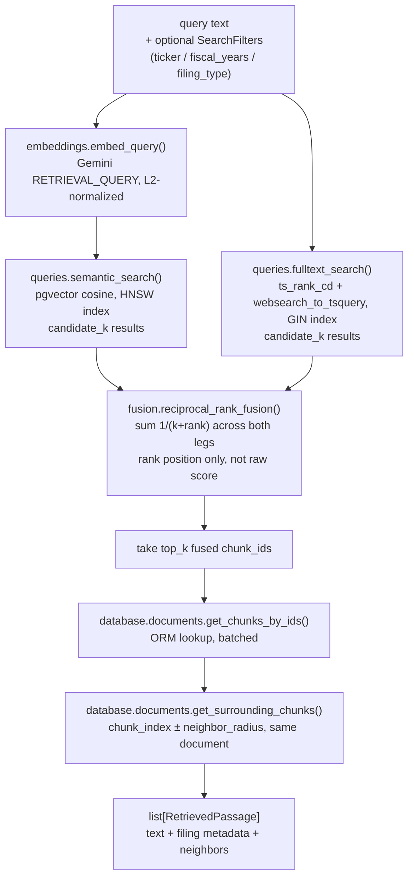

# Retrieval

Hybrid search over `document_chunks`: pgvector semantic search + Postgres full-text
search, fused with Reciprocal Rank Fusion (RRF), returning ranked passages with
neighboring chunks attached for grounding. See [../../../docs/architecture.md](../../../docs/architecture.md)
for the product-level design and [../../CLAUDE.md](../../CLAUDE.md) for backend conventions.

Nothing calls this yet — no FastAPI route exists. Phase 6's agent/orchestrator is
the intended caller, via bounded tools (`search_filings`, `read_chunk`,
`read_surrounding_chunks`) built on top of `DocumentRetriever` and `database/documents.py`.

## Pipeline



Semantic and full-text search run **sequentially**, not concurrently — a single
SQLAlchemy `AsyncSession` can't execute two statements at once (it raises
`InvalidRequestError: session is provisioning a new connection`). Two fast,
index-backed queries in a row is cheap enough that a second session just to
parallelize them wasn't worth the added complexity.

## Files

| File | Purpose |
|---|---|
| `types.py` | `SearchFilters`, `RankedChunkHit`, `RetrievedPassage` — Pydantic models shared by this package, its tests, and future Phase 6 agent tools |
| `embeddings.py` | `embed_query()` — Gemini client + L2 normalization for query-time embeddings. Deliberately duplicates `ingest/embed.py`'s ~15 lines rather than importing across the `app/`↔`ingest/` boundary |
| `queries.py` | The two retrieval legs: `semantic_search()`, `fulltext_search()`. Raw SQL via SQLAlchemy `text()`, filtered on `document_chunks.chunk_metadata` (no join — filing fields are denormalized there specifically so retrieval doesn't need one) |
| `fusion.py` | `reciprocal_rank_fusion()` — pure function, no I/O |
| `retriever.py` | `DocumentRetriever` — the single `.search(query, filters)` entry point that hides both legs, fusion, and hydration behind one call (same shape as querying a Pinecone index) |
| `../database/session.py` | Async SQLAlchemy engine/session over `settings.database_url` — the one place in the codebase that talks to Postgres directly instead of through the Supabase client, because pgvector distance ordering and ranked FTS need real SQL PostgREST can't express |
| `../database/documents.py` | ORM-based chunk/document lookups (`get_chunks_by_ids`, `get_surrounding_chunks`, `get_chunk_with_document`) — no vector/tsvector operators, just PK/FK reads |

## Default settings

All in `app/config.py`, overridable via `.env`:

| Setting | Default | Purpose |
|---|---|---|
| `retrieval_candidate_k` | `50` | Per-leg candidate pool size, before fusion |
| `retrieval_top_k` | `10` | Final fused passages returned by `DocumentRetriever.search()` |
| `retrieval_rrf_k` | `60` | RRF smoothing constant — larger values flatten the rank-position weighting |
| `retrieval_neighbor_radius` | `1` | Chunks fetched before/after each hit, same document (`chunk_index ± radius`) |
| `retrieval_fts_config` | `"english"` | Postgres text-search config; must match the migration's `to_tsvector('english', chunk_text)` |

## Why RRF fuses by rank, not score

Cosine similarity (semantic leg) and `ts_rank_cd` (full-text leg) live on completely
different, incomparable scales — summing them directly would be meaningless. RRF
sidesteps this by only using each chunk's **position** in its leg's ranking:

```
score(chunk) = Σ over legs where chunk appears:  1 / (rrf_k + rank_in_that_leg)
```

A chunk ranked well in *both* legs outscores one ranked #1 in only one — this is
what makes hybrid search better than either leg alone. Ported from the
[daveebbelaar/ai-cookbook hybrid-retrieval](https://github.com/daveebbelaar/ai-cookbook/tree/main/knowledge/hybrid-retrieval)
pattern.

## Usage

```python
from app.retrieval.retriever import DocumentRetriever
from app.retrieval.types import SearchFilters

passages = await DocumentRetriever().search(
    "How has Apple's revenue mix shifted across its 2021-2025 10-Ks?",
    filters=SearchFilters(ticker="AAPL"),  # all fields optional
)
for p in passages:
    print(p.ticker, p.filing_type, p.fiscal_year, p.fusion_score, p.text[:200])
```

Ad-hoc manual check against the live DB + Gemini (prints ranked passages, doesn't
assert anything): `uv run python scripts/smoke_retrieval.py "your question"` — see
[`../../scripts/smoke_retrieval.py`](../../scripts/smoke_retrieval.py).

Automated checks: `uv run pytest tests/retrieval/` (add `-m integration` for the
real-DB/real-Gemini tests; the fast suite mocks every I/O boundary).

## Platform note

`database/session.py` sets `asyncio.WindowsSelectorEventLoopPolicy()` on import,
Windows-only: psycopg3's async mode can't run on Windows' default
`ProactorEventLoop` (raises `psycopg.InterfaceError` on connect). Doesn't affect
Railway (Linux) hosting — only local dev on Windows.
